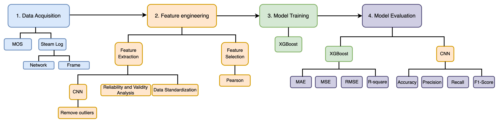
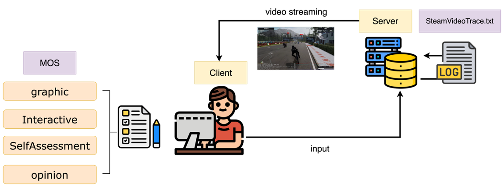
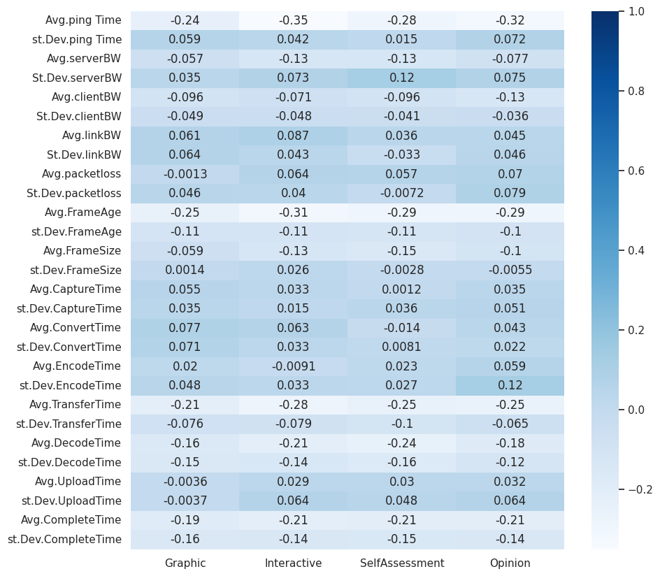

# Research on user experience quality of smart entertainment based on B5G architecture
- **Predict the quality of experience (QoE) of users when playing cloud games**

- Quality of Experience (QoE) is defined as "The degree of delight or annoyance of the user of an application or service. "
- **Divided into subjective QoE and objective QoE**
    - Subjective QoE measures service quality from the user's perspective
    - Objective QoE through network loading delay, lag time, resolution, frame rate(frame per second, FPS) parameters to evaluate network quality
## Research Method Structure


## 1. Data Acquisition
- **Subjective QoE:** 
    - After the subjects complete each round of the game, they will measure the level of picture quality (Graphics), game reaction time (Interactive), self-expression in the game (Self Assessment) and overall game experience in that round.  
    - This study uses a six-point Likert scale for subjective scoring. Six points means the best feeling, and one point means the worst feeling.
    -  This study intends to use the same network The scores of subjects' answers in the road environment are averaged, which is the Mean Opinion Score (MOS).
- **Objective QoE:**
    - When the subject is experiencing the game through the streaming game platform Steam, Steam will generate a streaming status record file (log) during the game and save it on the hard drive of the cloud server **every ten seconds**. 
    -  The record files generated by Steam can be divided into statistical data of the network and  frame data. 
        -  Network parameters such as ping, server bandwidth, client bandwidth, link bandwidth, packet loss rate.
        -  Frame parameters are frame size, frame age, capture time, encode time, transfer time, decode time, and complete time.
   

## 2. Feature engineering
### Organize Data
#### Screenshot 
```python
# 從 GCS 值區下載資料
#先建立好log與pic資料夾
!mkdir ./
!mkdir ./train
#圖檔放在資料夾中（來源：目的）
!gsutil -m cp -r gs://qoestorage/vm1/cnn.zip ./
```
- Unzip
```python
#unzip train data
!pip install zipfile
import os
import zipfile
#解壓縮要放到哪個目錄
url = '/content'
# zipfile example
def zip_list(file_path):
  zf = zipfile.ZipFile(file_path, 'r')
  zf.extractall(url)
 
if __name__ == '__main__':
  #壓縮檔位置
  file_path = '/content/cnn.zip'
  zip_list(file_path)
```

- Change file name

```python
#標記gaming=0
import os
#source
y=os.listdir('/content/CNN_training/0')
g=len(y)
#from to
for i in range(0, g):
   os.rename(f'/content/CNN_training/0/{y[i]}',f'/content/CNN_training/0/0_{i}.png')
```


- Move files in folder A to folder B

```python
#移動目的
import os
 
file_source = '/content/CNN_training/1/'
file_destination = '/content/train/'
 
get_files = os.listdir(file_source)
 
for g in get_files:
    os.replace(file_source + g, file_destination + g)
```

- Print file in the folder

```python
filenames = os.listdir("/content/train")
```

- Add labels 0 and 1 according to the number in front of the file name "_" to become a data frame

```python
categories = []
for filename in filenames:
    category = filename.split('_')[0]
    if category == '1':
        categories.append(1)
    else:
        categories.append(0)

df = pd.DataFrame({
    'filename': filenames,
    'category': categories
})
```

- Check if there are files with read errors in the folder and delete them


```python
import os
import shutil
import warnings
import cv2
import io
from PIL import Image
warnings.filterwarnings("error",category=UserWarning)
base_dir="/content/cnn/test_CNN/0"
i=0
def is_read_successfully(file):
  try:
    imgFile =Image.open(file)
    return True
  except Exception:
    return False
for parent, dirs, files in os.walk(base_dir):
  for file in files:
    if not is_read_successfully(os.path.join(parent, file)):
      print(os.path.join(parent, file))
      #os.remove(os.path.join(parent, file))先確定程式可以跑在用這行刪除
      i=i+1
print(i)
```
- Change picture format

```python
#修改圖片格式
import os,sys
folder = '/content/test_vm2'
for filename in os.listdir(folder):
       infilename = os.path.join(folder,filename)
       if not os.path.isfile(infilename): continue
       oldbase = os.path.splitext(filename)
       newname = infilename.replace('png', 'jpg')
       output = os.rename(infilename, newname)
```
- Label gaming=0
```python
#source
y=os.listdir('/Users/renjie/Desktop/實驗資料/cnn_picsorting/cnn 2/trian_CNN/0/')
g=len(y)
#from to
for i in range(0, g):
   os.rename(f'/Users/renjie/Desktop/實驗資料/cnn_picsorting/cnn 2/trian_CNN/0/{y[i]}',f'/Users/renjie/Desktop/實驗資料/cnn_picsorting/gaming/gaming_{i}.jpg')
```
- Label nogaming=1
```python
#source
y=os.listdir('/Users/renjie/Desktop/實驗資料/cnn_picsorting/cnn 2/test_CNN/1/')
g=len(y)
#from to
for i in range(0, g):
   os.rename(f'/Users/renjie/Desktop/實驗資料/cnn_picsorting/cnn 2/test_CNN/1/{y[i]}',f'/Users/renjie/Desktop/實驗資料/cnn_picsorting/nogaming/nogaming_{i}.jpg')
```
- Randomly assigned in the Train\Test\Validation folder
```python
import os
from random import shuffle
from shutil import copyfile

label0=os.listdir('/Users/renjie/Desktop/實驗資料/cnn_picsorting/gaming/')
label1=os.listdir('/Users/renjie/Desktop/實驗資料/cnn_picsorting/nogaming/')

shuffle(label0)
shuffle(label1)

# 0:2562=>513:513:1536
# 1:2664=>533:533:1598

train0=label0[:1536]
val0=label0[1536:513+1536]
test0=label0[513+1536:]
print(len(train0))

train1=label1[:1598]
val1=label1[1598:533+1598]
test1=label1[533+1598:]

print(len(train1))
```

```python
for f in train0:   
    copyfile('/Users/renjie/Desktop/實驗資料/cnn_picsorting/gaming/'+f,'/Users/renjie/Desktop/實驗資料/cnn_picsorting/train/'+ f)
for f in val0:
    copyfile('/Users/renjie/Desktop/實驗資料/cnn_picsorting/gaming/'+f,'/Users/renjie/Desktop/實驗資料/cnn_picsorting/val/'+ f)
for f in test0:
    copyfile('/Users/renjie/Desktop/實驗資料/cnn_picsorting/gaming/'+f,'/Users/renjie/Desktop/實驗資料/cnn_picsorting/test/'+ f)
for f in train1:
    copyfile('/Users/renjie/Desktop/實驗資料/cnn_picsorting/nogaming/'+f,'/Users/renjie/Desktop/實驗資料/cnn_picsorting/train/'+ f)
for f in val1:
    copyfile('/Users/renjie/Desktop/實驗資料/cnn_picsorting/nogaming/'+f,'/Users/renjie/Desktop/實驗資料/cnn_picsorting/val/'+ f)
for f in test1:
    copyfile('/Users/renjie/Desktop/實驗資料/cnn_picsorting/nogaming/'+f,'/Users/renjie/Desktop/實驗資料/cnn_picsorting/test/'+ f)
```
#### Log file
- Unzip file
```python
!pip install zipfile
import os
import zipfile
#解壓縮要放到哪個目錄
url = '/content/vm4/'
# zipfile example
def zip_list(file_path):
    zf = zipfile.ZipFile(file_path, 'r')
    zf.extractall(url)

if __name__ == '__main__':
    #壓縮檔位置
    file_path = '/content/drive/MyDrive/cloud gaming QoE prediction/data/vm4_txt.zip'
    zip_list(file_path)
```
- Order log file
```python
b = os.listdir(r"/content/vm1/")
b.sort(key = lambda x:x.split('.')[0][16:50].replace('_','').replace('(','').replace(')','').replace('-',''))
```
### Identified Gaming Screenshots by CNN Model
#### Train CNN Model
```python
import os
import numpy as np
import pandas as pd
import random
import matplotlib.pyplot as plt
import tensorflow as tf
from tensorflow import keras
from tensorflow.keras.models import load_model
from tensorflow.keras.preprocessing import image
from tensorflow.keras.applications.vgg16 import preprocess_input
from tensorflow.keras.utils import load_img
from tensorflow.keras.preprocessing.image import ImageDataGenerator
from keras.utils import to_categorical
from sklearn.model_selection import train_test_split
```
- Remove abnormal screenshots
```python
import os
import shutil
import warnings
import cv2
import io
from PIL import Image
warnings.filterwarnings("error",category=UserWarning)
base_dir="/content/test_vm1"
i=0
def is_read_successfully(file):
  try:
    imgFile =Image.open(file)
    return True
  except Exception:
    return False
for parent, dirs, files in os.walk(base_dir):
  for file in files:
    if not is_read_successfully(os.path.join(parent, file)):
      print(os.path.join(parent, file))
      os.remove(os.path.join(parent, file))
      i=i+1
print(i)
```
- Import and list Screenshot
```python
FAST_RUN = False
IMAGE_WIDTH=224
IMAGE_HEIGHT=224
IMAGE_SIZE=(IMAGE_WIDTH, IMAGE_HEIGHT)
IMAGE_CHANNELS=3
```
```python
filenames = os.listdir("/Users/renjie/Desktop/實驗資料/cnn_picsorting/train/")
categories = []
for filename in filenames:
    category = filename.split('_')[0]
    if category == 'gaming':
        categories.append(0)
    else:
        categories.append(1)

train_df = pd.DataFrame({
    'filename': filenames,
    'category': categories
})
```
- Check Gaming and no Gaming Screenshot 
```python
validate_df['category'].value_counts().plot.bar
image = load_img("/Users/renjie/Desktop/實驗資料/cnn_picsorting/test/gaming_1023.jpg")
plt.imshow(image)
```
- Build CNN Model
```python
from keras.models import Sequential
from keras.layers import Conv2D, MaxPooling2D, Dropout, Flatten, Dense, Activation, BatchNormalization

model = Sequential()

model.add(Conv2D(32, (3, 3), activation='relu', input_shape=(IMAGE_WIDTH, IMAGE_HEIGHT, IMAGE_CHANNELS)))
model.add(BatchNormalization())
model.add(MaxPooling2D(pool_size=(2, 2)))
model.add(Dropout(0.25))

model.add(Conv2D(64, (3, 3), activation='relu'))
model.add(BatchNormalization())
model.add(MaxPooling2D(pool_size=(2, 2)))
model.add(Dropout(0.25))

model.add(Conv2D(128, (3, 3), activation='relu'))
model.add(BatchNormalization())
model.add(MaxPooling2D(pool_size=(2, 2)))
model.add(Dropout(0.25))

model.add(Flatten())
model.add(Dense(512, activation='relu'))
model.add(BatchNormalization())
model.add(Dropout(0.5))

# model.add(Dense(128, activation='relu'))
# model.add(BatchNormalization())
# model.add(Dropout(0.5))

model.add(Dense(1, activation='sigmoid')) # 2 because we have cat and dog classes

#model.compile(loss='categorical_crossentropy', optimizer='rmsprop', metrics=['accuracy'])

model.compile(loss='binary_crossentropy', optimizer='adam', metrics=['accuracy'])

model.summary()
```

#### Validate CNN Model
- Prevent over fitting 
```python
from keras.callbacks import EarlyStopping, ReduceLROnPlateau
#To prevent over fitting we will stop the learning after 10 epochs and val_loss value not decreased
earlystop = EarlyStopping(patience=10)
#We will reduce the learning rate when then accuracy not increase for 2 steps
learning_rate_reduction = ReduceLROnPlateau(monitor='val_accuracy', 
                                            patience=2, 
                                            verbose=1, 
                                            factor=0.5, 
                                            min_lr=0.00001)
callbacks = [earlystop, learning_rate_reduction]
```
- Change Screenshot's name
```python
train_df["category"] = train_df["category"].replace({0: 'gaming', 1: 'not gameing'}) 
validate_df["category"] = validate_df["category"].replace({0: 'gaming', 1: 'not gameing'})
train_df = train_df.reset_index(drop=True)
validate_df = validate_df.reset_index(drop=True)
test_df = test_df.reset_index(drop=True)
```

```python
total_train = train_df.shape[0]
total_validate = validate_df.shape[0]
total_test=test_df.shape[0]
batch_size=16
```
- Training generator
```python
#Traning Generator
train_datagen = ImageDataGenerator(
    rotation_range=15,
    rescale=1./255,
    shear_range=0.1,
    zoom_range=0.2,
    horizontal_flip=True,
    width_shift_range=0.1,
    height_shift_range=0.1
)

train_generator = train_datagen.flow_from_dataframe(
    train_df, 
    "/Users/renjie/Desktop/實驗資料/cnn_picsorting/train/", 
    x_col='filename',
    y_col='category',
    target_size=IMAGE_SIZE,
    class_mode='binary',
    batch_size=batch_size
)
validation_datagen = ImageDataGenerator(rescale=1./255)
validation_generator = validation_datagen.flow_from_dataframe(
    validate_df, 
    "/Users/renjie/Desktop/實驗資料/cnn_picsorting/val/", 
    x_col='filename',
    y_col='category',
    target_size=IMAGE_SIZE,
    class_mode='binary',
    batch_size=batch_size
)
```
- **Training CNN Model**
```python
epochs=5 
history = model.fit(
        train_generator, 
        epochs=epochs,
        validation_data=validation_generator,
        validation_steps=total_validate//batch_size,
        steps_per_epoch=total_train//batch_size,
        callbacks=callbacks
  )
```
- Save CNN model
```python
model.save("0507model.h5")
```
#### CNN Model Performance
- Training Plot
```python
fig, (ax1, ax2) = plt.subplots(2, 1, figsize=(12, 12),dpi=800,)
ax1.plot(history.history['loss'], color='b', label="Training loss")
ax1.plot(history.history['val_loss'], color='r', label="validation loss")
ax1.set_xticks(np.arange(1, epochs, 1))
ax1.set_yticks(np.arange(0, 1, 0.1))

ax2.plot(history.history['accuracy'], color='b', label="Training accuracy")
ax2.plot(history.history['val_accuracy'], color='r',label="Validation accuracy")
ax2.set_xticks(np.arange(1, epochs, 1))

legend = plt.legend(loc='best', shadow=True)
plt.tight_layout()
plt.show()
```
#### CNN prediction
```python
filepath='/content/model.h5'
model = load_model(filepath)
```
- Put file name in field
```python
b = os.listdir(r"/content/test_vm1")
b.sort(key = lambda x:x.split('.')[0][16:50].replace('_','').replace('(','').replace(')','').replace('-',''))

test_df = pd.DataFrame({
    'file': b
})
nb_samples = test_df.shape[0]
```
- Predict Screenshot
```python
FAST_RUN = False
IMAGE_WIDTH=128
IMAGE_HEIGHT=128
IMAGE_SIZE=(IMAGE_WIDTH, IMAGE_HEIGHT)
IMAGE_CHANNELS=3
batch_size=15
```

```python
test_gen = ImageDataGenerator(rescale=1./255)
test_generator = test_gen.flow_from_dataframe(
    test_df,
    "/content/test_vm1/",
    x_col='file',
    y_col=None,
    class_mode=None,
    target_size=IMAGE_SIZE,
    batch_size=batch_size,
    shuffle=False
)
```
- **Predict other screenshot**
```python
predict = model.predict(test_generator, steps=np.ceil(nb_samples/batch_size),
                                 verbose=1)
```
- Changes the shape of an array 
```python
pred=preds.reshape(1046)
test_val= test_val.reshape(1046)
test_val.shape
```
- This threshold will be used to classify or binarize predictions
```python
threshold=0.9
pred = pred >= threshold
pred9 = pred.astype(int)
pred9
```
- Or use argmax to classify predictions
```python
test_df['category'] = np.argmax(predict, axis=-1)
```
- Print the classification
```python
test_val[:10],pred9[:10]
```
- Model performance
```python
from sklearn.metrics import classification_report
target_names = ['gaming', 'nogaming']
y_true = test_val
y_pred = pred9
print(classification_report(y_true, y_pred, target_names=target_names))
```
- PR Curve
```python
from sklearn.metrics import precision_recall_curve
import matplotlib.pyplot as plt

y_true = test_val
y_scores = pred4

precision, recall, thresholds = precision_recall_curve(y_true, y_scores)
plt.plot(recall, precision,marker='.')

plt.xlabel('Recall')
plt.ylabel('Precision')
plt.title('PR Curve')
plt.show()
```

- Show screenshot
```python
sample_test = test_df.head(18)
sample_test.head()
plt.figure(figsize=(24, 24))
for index, row in sample_test.iterrows():
    filename = row['file']
    category = row['category']
    img = load_img("/content/test_vm1/"+filename, target_size=IMAGE_SIZE)
    plt.subplot(6, 3, index+1)
    plt.imshow(img)
    plt.xlabel(filename + '(' + "{}".format(category) + ')' )
plt.tight_layout()
plt.show()
```


### Spilt Each User's Time Stamp
- Import the time when users start and end filling in the questionnaire

```python
import numpy as np
import matplotlib.pyplot as plt
import pandas as pd

#後側問卷
back = pd.read_excel('/content/back_mos2.xlsx')
#修改欄位名稱
back.rename(columns={'時間戳記': 'endtime','座位編號': 'seat','姓名': 'name'},inplace=True) 
#前測問卷
front = pd.read_excel('/content/front_mos2.xlsx')
front.rename(columns={'時間戳記': 'starttime','受測時的座位編號 (張貼於座位左側)': 'seat','姓名': 'name'},inplace=True) #修改欄位名稱

```

- merge

```python
#merge
f=front[['starttime','seat','name']]
b=back[['endtime','name']]
time=pd.merge(f, b, on='name')
time
```

- convert starttime to time format, and conversion time to vm time

```python
from datetime import datetime, timedelta

time["starttime_new"] = time['starttime'] - timedelta(hours=8)
time["endtime_new"] = time['endtime'] - timedelta(hours=8)

time.to_csv('time.csv')
```
- Import subject experience time comparison table

```python
#匯入受試者體驗時間對照表
datatime = pd.read_csv('/content/time.csv')
datatime["starttime_new"] = pd.to_datetime(datatime["starttime_new"])
datatime["endtime_new"] = pd.to_datetime(datatime["endtime_new"])

#抓第一個位置
datatime = datatime[datatime['seat']==1.0]
datatime=datatime.drop(labels=['level_0','index','Unnamed: 0'],axis='columns') #刪除欄位

#列出vm1裏所有檔案
b = os.listdir(r"/content/qoestorage/vm1/log")
#排列檔案順序
b.sort(key = lambda x:x.split('.')[0][16:50].replace('_','').replace('(','').replace(')','').replace('-',''))

#file name convert to datetime format
import time,datetime
r = datetime.datetime.strptime(b[5][32:37]+'-2022-'+b[5][41:49],"%m-%d-%Y-%H-%M-%S")

#抓出所有受試者的所有log檔
# 2-6位受試者沒有資料
w=0
player_log = pd.DataFrame()
for i in b[3:]:
  for t in range(1,21):
    r = datetime.datetime.strptime(i[32:37]+'-2022-'+i[41:49],"%m-%d-%Y-%H-%M-%S")
    if datatime['starttime_new'][t]<r and datatime['endtime_new'][t]>r:
      temp_dict = {"user":datatime['name'][t],"file":i}
      df_temp = pd.DataFrame(temp_dict,index = [0])
      player_log = player_log.append(df_temp)
  
      w+=1

player_log
```
### Steam Log File Preprocessing
- create network function for deal with log.txt

```python
! pip install nums_from_string

#算每一個log參數的AVG,STD(修正版)
#num test
#使用 get_nums() 函數
# 載入現成套件

import numpy as np
import matplotlib.pyplot as plt
import pandas as pd
import warnings
import nums_from_string as nfs

def network(file):
  Path = "/content/qoestorage/vm3/log/"
  df = pd.read_csv(Path + file ,delimiter="\t",names=['data']) #將資料變成dataframe
  # Path = "/content/"
  # df = pd.read_csv(Path + file,delimiter="\t",names=['data']) #將資料變成dataframe
  df[['ping', 'server', 'client','link','packetloss']] = df.data.str.split(',', expand=True)

  #把data丟掉
  data2 = df.drop(labels=['data'],axis='columns')
  #顯示出NETWORK開頭的資料
  net_sta2=data2[data2.ping.str.startswith('NETWORK')] 

  net_sta2.reset_index(inplace=True, drop=True)

  ping_list = []
  server_list = []
  client_list = []
  link_list = []
  packetloss_list = []
  for i in range(len(net_sta2)):
    ping = net_sta2.iloc[i, 0]
    ping_new = nfs.get_nums(ping)
    #多個list轉在一起
    ping_num = [str(integer) for integer in ping_new]
    ping_nums = float("".join(ping_num))
    ping_list.append(ping_nums)

    server = net_sta2.iloc[i, 1]
    server_new = nfs.get_nums(server)
    server_num = [str(integer) for integer in server_new]
    server_nums = float("".join(server_num))
    server_list.append(server_nums)

    client = net_sta2.iloc[i, 2]
    client_new = nfs.get_nums(client)
    client_num = [str(integer) for integer in client_new]
    client_nums = float("".join(client_num))
    client_list.append(client_nums)

    link = net_sta2.iloc[i, 3]
    link_new = nfs.get_nums(link)
    link_num = [str(integer) for integer in link_new]
    link_nums = float("".join(link_num))
    link_list.append(link_nums)

    packetloss = net_sta2.iloc[i, 4]
    packetloss_new = nfs.get_nums(packetloss)
    packetloss_num = [str(integer) for integer in packetloss_new]
    packetloss_nums = float("".join(packetloss_num))
    packetloss_list.append(packetloss_nums)

  net_sta2.insert(5, 'ping_new', ping_list)
  net_sta2.insert(6, 'server_new', server_list)
  net_sta2.insert(7, 'client_new', client_list)
  net_sta2.insert(8, 'link_new', link_list)
  net_sta2.insert(9, 'packetloss_new', packetloss_list)
  net= net_sta2.drop(labels=['ping','server','client','link','packetloss'],axis='columns')

  #all frame data
  #抓frameage的資料
  frameage = pd.DataFrame(columns = ["frameage", "framesize", "cap_time", "con_time","Encode_time", "transfer_time", "Decode_time","Upload_time", "complete_time"])
  total = "total" 
  loc=df[df['data'].str.contains(total, na=False)]
  t =loc.data.str.split(':', expand=True).pop(1)
  age=t.str.split('ms', expand=True).pop(0)
  frameage['frameage']=age
  frameage.reset_index(inplace=True, drop=True)
  #framesize	
  str_choice = "Frame:" 
  loc=df[df['data'].str.contains(str_choice, na=False)]
  Frame=loc.data.str.split(',', expand=True).pop(1)
  framesize=Frame.str.split('bytes', expand=True).pop(0)
  framesize.reset_index(inplace=True, drop=True)
  frameage['framesize']=framesize
  #cap_time
  str_choice = "CaptureEnd" 
  loc=df[df['data'].str.contains(str_choice, na=False)]
  cap=loc.data.str.split('delta:', expand=True).pop(1)
  Capture=cap.str.split('ms', expand=True).pop(0)
  Capture.reset_index(inplace=True, drop=True)
  frameage['cap_time']=Capture
  #con_time
  str_choice = "ConvertEnd" 
  loc=df[df['data'].str.contains(str_choice, na=False)]
  con=loc.data.str.split('delta:', expand=True).pop(1)
  Convert=con.str.split('ms', expand=True).pop(0)
  Convert.reset_index(inplace=True, drop=True)
  frameage['con_time']=Convert
  #Encode_time
  str_choice = "EncodeEnd" 
  loc=df[df['data'].str.contains(str_choice, na=False)]
  Encode=loc.data.str.split('delta:', expand=True).pop(1)
  EncodeEnd=Encode.str.split('ms', expand=True).pop(0)
  EncodeEnd.reset_index(inplace=True, drop=True)
  frameage['Encode_time']=EncodeEnd
  #transfer_time
  str_choice = "EventRecv" 
  loc=df[df['data'].str.contains(str_choice, na=False)]
  Event=loc.data.str.split('delta:', expand=True).pop(1)
  EventRecv=Event.str.split('ms', expand=True).pop(0)
  EventRecv.reset_index(inplace=True, drop=True)
  frameage['transfer_time']=EventRecv

  #upload_time
  str_choice = "UploadEnd" 
  loc=df[df['data'].str.contains(str_choice, na=False)]
  Upload=loc.data.str.split('delta:', expand=True).pop(1)
  Upload=Upload.str.split('ms', expand=True).pop(0)
  Upload.reset_index(inplace=True, drop=True)
  frameage['Upload_time']=Upload
  #Decode_time
  str_choice = "DecodeEnd" 
  loc=df[df['data'].str.contains(str_choice, na=False)]
  Decode=loc.data.str.split('delta:', expand=True).pop(1)
  DecodeEnd=Decode.str.split('ms', expand=True).pop(0)
  DecodeEnd.reset_index(inplace=True, drop=True)
  frameage['Decode_time']=DecodeEnd

  #complete_time
  str_choice = "EventComplete" 
  loc=df[df['data'].str.contains(str_choice, na=False)]
  Complete=loc.data.str.split('delta:', expand=True).pop(1)
  complete_time=Complete.str.split('ms', expand=True).pop(0)
  complete_time.reset_index(inplace=True, drop=True)
  frameage['complete_time']=complete_time
  #轉成float
  frameage['frameage'] = pd.to_numeric(frameage ['frameage'], errors='coerce')
  frameage['framesize'] = pd.to_numeric(frameage ['framesize'], errors='coerce')
  frameage['cap_time'] = pd.to_numeric(frameage ['cap_time'], errors='coerce')
  frameage['con_time'] = pd.to_numeric(frameage ['con_time'], errors='coerce')
  frameage['Encode_time'] = pd.to_numeric(frameage ['Encode_time'], errors='coerce')
  frameage['transfer_time'] = pd.to_numeric(frameage ['transfer_time'], errors='coerce')
  frameage['Decode_time'] = pd.to_numeric(frameage ['Decode_time'], errors='coerce')
  frameage['Upload_time'] = pd.to_numeric(frameage ['Upload_time'], errors='coerce')
  frameage['complete_time'] = pd.to_numeric(frameage ['complete_time'], errors='coerce')
  frameage=frameage.fillna(0) 

  alldata=net.join(frameage, how='left')
  qos = {'Avg.pingTime':alldata['ping_new'].mean(), "st.Dev.pingTime": alldata['ping_new'].std(),
          'Avg.serverBW':alldata['server_new'].mean(), "St.Dev.serverBW": alldata['server_new'].std(),
          'Avg.clientBW':alldata['client_new'].mean(), "St.Dev.clientBW": alldata['client_new'].std(),
          'Avg.linkBW':alldata['link_new'].mean(), "St.Dev.linkBW": alldata['link_new'].std(),
          'Avg.packetloss':alldata['packetloss_new'].mean(), "St.Dev.packetloss": alldata['packetloss_new'].std(),
          'Avg.FrameAge':alldata['frameage'].mean(), "st.Dev.FrameAge": alldata['frameage'].std(),
          'Avg.FrameSize':alldata['framesize'].mean(), "st.Dev.FrameSize": alldata['framesize'].std(),
          'Avg.CaptureTime':alldata['cap_time'].mean(), "st.Dev.CaptureTime": alldata['cap_time'].std(),
          'Avg.ConvertTime':alldata['con_time'].mean(), "st.Dev.ConvertTime": alldata['con_time'].std(),
          'Avg.EncodeTime':alldata['Encode_time'].mean(), "st.Dev.EncodeTime": alldata['Encode_time'].std(),
          'Avg.TransferTime':alldata['transfer_time'].mean(), "st.Dev.TransferTime": alldata['transfer_time'].std(),
          'Avg.DecodeTime':alldata['Decode_time'].mean(), "st.Dev.DecodeTime": alldata['Decode_time'].std(),
          'Avg.UploadTime':alldata['Upload_time'].mean(), "st.Dev.UploadTime": alldata['Upload_time'].std(),
          'Avg.CompleteTime':alldata['complete_time'].mean(), "st.Dev.CompleteTime": alldata['complete_time'].std()
          }
  sts_cor_qos = pd.DataFrame(qos, index = [0])
  sts_cor_qos=sts_cor_qos.round(3)
  return sts_cor_qos
```
- try-except

```python
x = pd.DataFrame()#create dataframe
b = os.listdir(r"/content/qoestorage/vm3/log")#list the file name
#sort the file name
b.sort(key = lambda x:x.split('.')[0][16:50].replace('_','').replace('(','').replace(')','').replace('-',''))

for i in b:
  try:
    df = network(f"{i}") #network is the function
    df["file"] = i  #filename store in file col
    x = x.append(df) #new data
  except:
    print(f"error with the file-{i}")
    pass
```
- Add a field for the file name
- Use . to cut the field to get the 0th value
- index reordering
```python
x['file'].str.split('_StreamVideoTrace').str[0]
x=x.reset_index(drop=True)
x
```
### Merge Steam Log File and Each User's Time Stamp
- Since the streaming status record file is recorded every **10 seconds**, and the game experience time of each round is limited to **1 minute**. There are ten rounds in total. Therefore, each subject will have at least **60 screenshots** of the ongoing game experience and the corresponding streaming status record files. If the subject's streaming status record file data is less than 60, it will be regarded as invalid data. 


- merge log file and user
```python
# x =Each log AVG and Std
all=pd.merge(player_log, x, on='file')
all.to_csv('all.csv')
```
### Pearson Correlation Analysis
```python
import seaborn as sns
a=CNNLOGMOSALL.corr()
b=a.iloc[0:28,28:32]
sns.set(context="notebook",style="whitegrid",palette="dark")
plt.subplots(figsize=(10,10)) #設置長寬尺吋大小
c1 = sns.heatmap(b, annot = True, vmax = 1,cmap="Blues")
plt.savefig("rawrelation_0412.png", dpi=800)
```



### XGBoost Model

```python
import xgboost
# First XGBoost model for Pima Indians dataset
from numpy import loadtxt
from xgboost import XGBClassifier
from sklearn.model_selection import train_test_split
from sklearn.metrics import accuracy_score
```
```python
import pandas as pd
from sklearn.model_selection import train_test_split
from xgboost import XGBRegressor
from sklearn.metrics import mean_squared_error, r2_score,mean_absolute_error,mean_squared_error,explained_variance_score


# Step 1: 讀取CSV檔案
# data = pd.read_csv('/content/pseudo0514.csv')


# Step 2: 資料前處理（如果需要的話）
# 處理缺失值、特徵縮放、類別特徵編碼等

# Step 3: 資料拆分為訓練集和測試集
X = CNNLOGMOSALL.iloc[:,2:30]  # 特徵列
y = CNNLOGMOSALL.iloc[:,31:34] # 目標變數

X_train, X_test, y_train, y_test = train_test_split(X, y, test_size=0.2, random_state=42)

# Step 4: 模型建立
model = XGBRegressor()

# Step 5: 模型訓練
model.fit(X_train, y_train)

# Step 6: 模型預測
y_pred = model.predict(X_test)

# Step 7: 模型評估
#（MAE、MSE、RMSE）越小越好
#R2 Score、Explained Variance Score越接近1越好

mse = mean_squared_error(y_test, y_pred)
r2 = r2_score(y_test, y_pred)

mae = mean_absolute_error(y_test, y_pred)
print('Mean Absolute Error (MAE):', mae)

print('Mean Squared Error (MSE):', mse)

mse = mean_squared_error(y_test, y_pred)
rmse = np.sqrt(mse)
print('Root Mean Squared Error (RMSE):', rmse)

print('R-squared (R2) Score:', r2)


evs = explained_variance_score(y_test, y_pred)
print('Explained Variance Score:', evs)
```
## CNN file location

Run the CNN model on the local machine. The trained model is placed in the experimental folder with the file name 0507model.h5.

